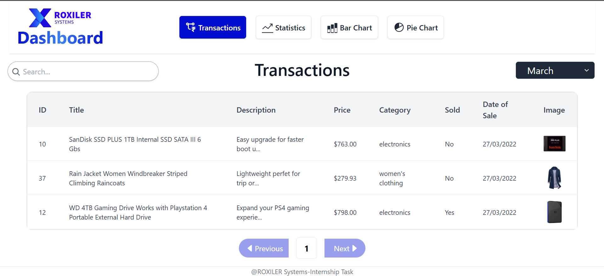

# ROXILER-Systems-MERN-Coding-Challenge

A modern transactions dashboard application that provides a clear visualization of monthly transactions through interactive tables and charts.

Problem Statement : [https://drive.google.com/file/d/1EWIwgu3PktuSixKcturVMF3Wi-T_j7ou/view](https://drive.google.com/file/d/1EWIwgu3PktuSixKcturVMF3Wi-T_j7ou/view).

### Live Demo
Visit : [https://roxiler-systems-transactions.netlify.app](https://roxiler-systems-transactions.netlify.app)
## Technologies Used

### Frontend
- React.js for UI components
- React Router for routing
- Recharts for data visualization
- Tailwind CSS for styling

### Backend
- Node.js & Express.js server
- MongoDB for data storage
- Mongoose for database modeling
## Setup and Installation

### Prerequisites

- Node.js
- MongoDB

### Installation


1. Install frontend dependencies:
      ```bash
      cd frontend
      npm install
      ```
2. Install backend dependencies:
     ```bash
     cd ../backend
     npm install
    ```    

### Environment Variables
Create a  .env   file in the backend directory and add the following variables:

```bash
 PORT = your_app_port
 MONGODB_URL= your_mongodb_url
```


## Screenshots



